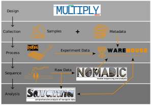

***

<b>Welcome to the NOMADS Community</b>

# Overview
The NMEC Oxford Malaria Amplicon Drug-resistance Sequencing (NOMADS) project began in 2021 with funding from the Bill & Melinda Gates Foundation to develop an **affordable**, **field-deployable**, long-read sequencing assay for malaria genomic surveillance. The resultant assay that targeted all loci associated with antimalarial drug resistance and diagnostic escape has been [publicly released](https://www.protocols.io/view/cost-effective-targeted-nanopore-sequencing-of-p-f-yxmvm25m6g3p/v2) and [published](https://pubmed.ncbi.nlm.nih.gov/38360754/)1. Additional funding has expanded the original project to these three aims:

1. Integrate nanopore sequencing into routine surveillance in Zambia
2. Expand nanopore sequencing to new geographies through collaboration and capacity building
3. Optimize existing and develop novel nanopore sequencing assays for malaria molecular surveillance

1 de Cesare, M. et al. Flexible and cost-effective genomic surveillance of *P. falciparum* malaria with targeted nanopore sequencing. Nat Commun 15, 1413 (2024).

# Resources
A collection of general resources e.g. protcols, primer sequences etc are now available to support the NOMADS community in implementing NOMADS assays.

Github repository: https://github.com/nomads-community/resources

# Software
A key component of NOMADS is making software to support implementation of the NOMADS assay. This github community includes all the tools and documentation required and currently features the four tools that interact with the assay as follows:

## multiply
The starting point of any implementation is ensuring that all targets are represented in the target panel. `multiply` is a command-line tool that enables the *in silico* design of multiplexed PCRs for a user-specified set of target genes and / or regions. `multiply` can essentially target any genome or groups of genomes, and is highly flexible e.g. it can be used to augment / expand an existing panel of primers to include new targets.

Github repository https://github.com/JasonAHendry/multiply

## warehouse
Sequencing data is complex and nuanced. To ensure that sequencing is comparable, trackable and well recorded, `warehouse` 'supports streamlining and standardising the standardised collection, aggregation and visualisation of data generated in a NOMADS project. In particular, it encourages all experimental data to be recorded using a standardised Excel template. Python scripts then ingest, analyse and give the end-user feedback on data quality and experimental status.

Github repository: https://github.com/nomads-community/warehouse

## nomadic
Nanopore sequencing generates reads that are immediately available for analysis i.e. during the run. `nomadic` is a dashboard interface that allows end-users to analyse NOMADS data in real-time as it is sequenced. This enables the end-user to assess coverage of target regions, amplicon balance, intra-sample variation etc., to determine when enough data have been collected as well as providing preliminary variant calling on mutations identified.

Github repository: https://github.com/JasonAHendry/nomadic

## savanna
Sequence data analysis can be computationally expensive. While `nomadic` outputs give good approximations to draw conclusions regarding the status of a run, more accurate summaries are required for final conclusions to be drawn. `savanna` provides this higher accuracy analysis for each NOMADS sequencing run.

Github repository: https://github.com/JasonAHendry/savanna

***

# Bioinformatics

Recognising that bioinformatic capacity is often lacking in resource limited settings, the NOMADS team also maintains a repository with materials and resources to introduce collaborators and others interested in nanopore sequencing to some bioinformatic tools and concepts through worked practicals.

Github repository: https://github.com/nomads-community/bioinformatics

***

For more information or if you are inteerested in implementing NOMADS, please contact:

- Daniel Bridges - dbridges@path.org
- Jason Hendry - jason.ahendry@gmail.com
- Mulenga Mwenda - mchimfwembe@path.org

***
