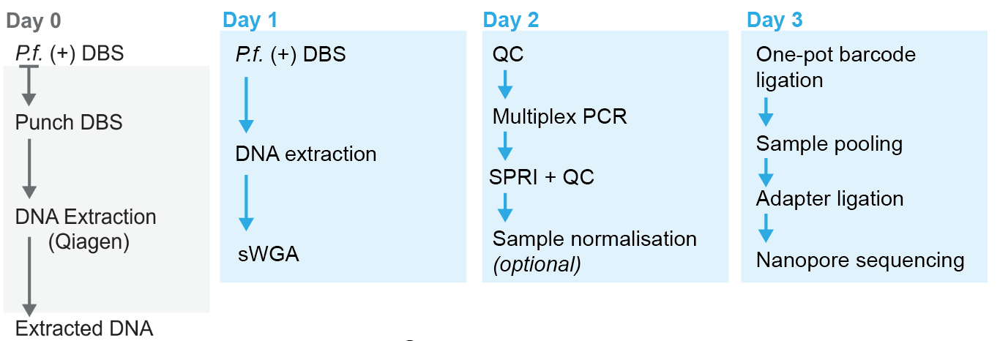
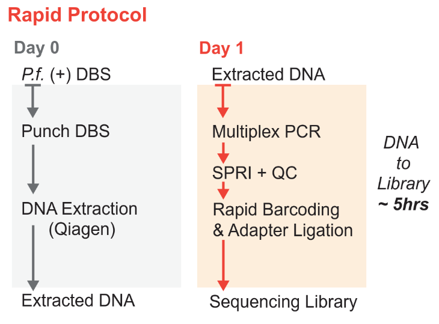

***

<b>Welcome to the NOMADS Community</b>

# Overview
The NMEC Oxford Malaria Amplicon Drug-resistance Sequencing (NOMADS) project began in 2020 with funding from the Bill & Melinda Gates Foundation to develop an **affordable**, **field-deployable**, long-read sequencing assay for malaria genomic surveillance. Since its inception, two targeted amplicon assays have been released:

### NOMADS 8/16

The first assay developed has two panels targeting either 8 (NOMADS8) or 16 (NOMADS16) genes associated with drug resistance, diagnostic escape, vaccine target and genetic diversity [published](https://pubmed.ncbi.nlm.nih.gov/38360754/)1. This assay prioritised generation of long e.g. reads spanning entire target genes. The [protocol](https://www.protocols.io/view/cost-effective-targeted-nanopore-sequencing-of-p-f-yxmvm25m6g3p/v2) takes 3 days and involves a significant number of processes including a 17 hour selective Whole Genome Amplification (sWGA) step. 

1 de Cesare, M. et al. Flexible and cost-effective genomic surveillance of *P. falciparum* malaria with targeted nanopore sequencing. Nat Commun 15, 1413 (2024).

### NOMADS MVP Rapid

The Minimal Viable Product (MVP) Rapid assay emphasises:
1. **Ease of use** by reducing the number of steps
2. **Improved sensitivity** by reducing target amplicon size
3. **Essential Targets** by focusing on a minimal set of targets that are directly relevent to public health decision making

This is available as a pre-print: https://www.biorxiv.org/content/10.1101/2025.07.23.666274v1

# Resources
A collection of general resources e.g. protocols, ordering worksheets etc to support groups implementing NOMADS assays.

Github repository: https://github.com/nomads-community/resources

# Software
A key component of NOMADS is making software to support implementation of the NOMADS assay. We strive to produce tools that are easy to implement and focus on enabling implementers to independently run and analyse their own data  

### nomadic
Nanopore sequencing generates reads that are immediately available for analysis i.e. during the run. `nomadic` is a dashboard interface that allows end-users to analyse NOMADS data in real-time as it is sequenced. This enables the end-user to assess coverage of target regions, amplicon balance, intra-sample variation etc., to determine when enough data have been collected as well as providing preliminary variant calling on mutations identified.

https://jasonahendry.github.io/nomadic/

### multiply
`multiply` enables the *in silico* design of multiplexed PCRs for a user-specified set of target genes and / or regions. `multiply` can essentially target any genome or groups of genomes, and is highly flexible e.g. it can be used to augment / expand an existing panel of primers to include new targets. Users can therefore alter existing, or create new target panel(s). 

https://github.com/JasonAHendry/multiply

*** 

# Bioinformatics

Recognising that bioinformatic capacity is often lacking in resource limited settings, the NOMADS team also maintains a repository with materials and resources to introduce collaborators and others interested in nanopore sequencing to some bioinformatic tools and concepts through worked practicals.

Github repository: https://github.com/nomads-community/bioinformatics

***

For more information or if you are interested in implementing NOMADS, please contact:

- Daniel Bridges - dbridges@path.org
- Jason Hendry - jason.ahendry@gmail.com
- Mulenga Mwenda - mchimfwembe@path.org

***
